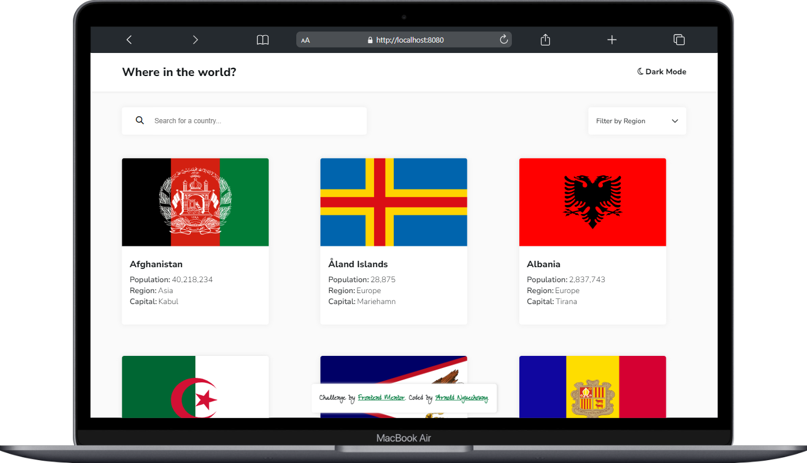
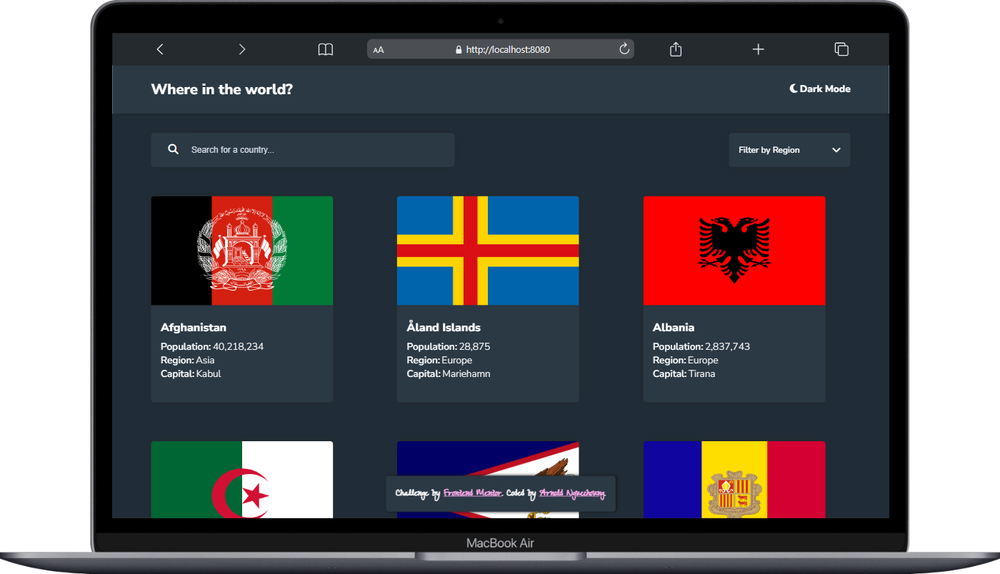
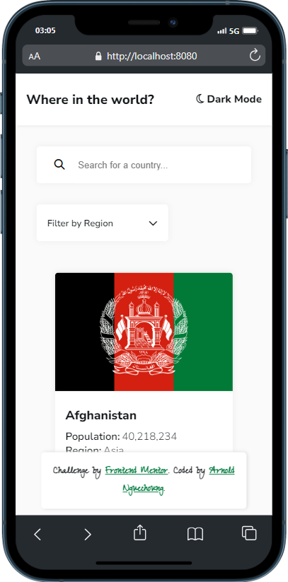
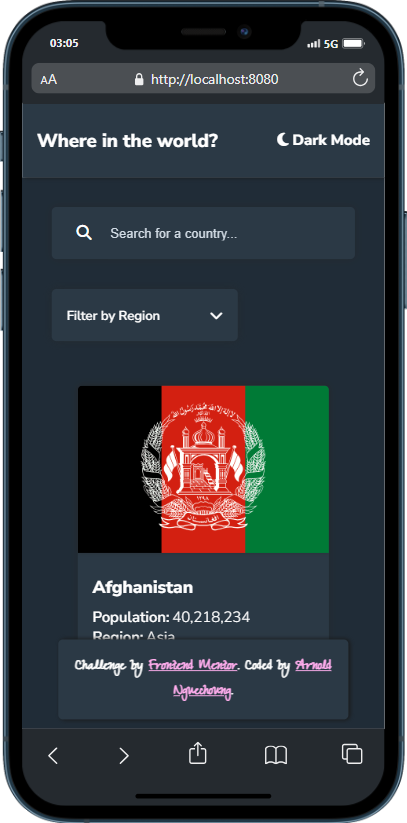

# Frontend Mentor - REST Countries API with color theme switcher solution

This is a solution to the [REST Countries API with color theme switcher challenge on Frontend Mentor](https://www.frontendmentor.io/challenges/rest-countries-api-with-color-theme-switcher-5cacc469fec04111f7b848ca). Frontend Mentor challenges help you improve your coding skills by building realistic projects. 

## Table of contents

- [Overview](#overview)
  - [The challenge](#the-challenge)
  - [Screenshot](#screenshot)
  - [Links](#links)
- [My process](#my-process)
  - [Built with](#built-with)
  - [What I learned](#what-i-learned)
  - [Continued development](#continued-development)
  - [Useful resources](#useful-resources)
- [Author](#author)
- [Acknowledgments](#acknowledgments)

## Overview

### The challenge

Users should be able to:

- See all countries from the API on the homepage
- Search for a country using an `input` field
- Filter countries by region
- Click on a country to see more detailed information on a separate page
- Click through to the border countries on the detail page
- Toggle the color scheme between light and dark mode *(optional)*

### Screenshot
on desktop:

on mobile:
|  |  |
|:----------------------:|:----------------------:|

### Links

- Solution URL: [On github](https://your-solution-url.com)
- Live Site URL: [Live preview](https://your-live-site-url.com)

## My process

### Built with

- Semantic HTML5 markup
- CSS custom properties
- Flexbox
- CSS Grid
- Javascript
- fetch API for javascript

### What I learned

I enjoyed learning APIs here and I am still greatly improving my javascript skills.

### Continued development

I'm looking forward to discovering other challenges.

### Useful resources

- [W3schools](https://www.W3schools.com) - it is a varied source of information for coding.
- [Developper Mozilla](developer.mozilla.org) - This is my toolbox.

## Author

- Website - [Arnold Nguechoung](https://github.com/escannord)
- Frontend Mentor - [@escannord](https://www.frontendmentor.io/profile/escannord)
- Twitter - [@ANguechoung](https://x.com/ANguechoung)

## Acknowledgments

I thanks Frontend Mentor for this experience

